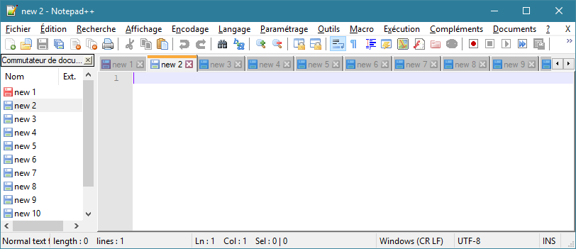
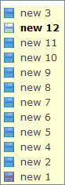

# Commutateur de document

Le commutateur de document est un panneau de l'[interface](interface.md) ou une liste flottante listant les documents ouverts et permettant de naviguer entre eux. Il peut servir d'alternative aux onglets.

Le panneau peut s'activer dans les [préférences générales](preferences/general.md).

Les [raccourcis clavier](raccourcis-clavier.md) par défaut <kbd>Ctrl</kbd>+<kbd>Tab</kbd> et <kbd>Ctrl</kbd>+<kbd>Shift</kbd>+<kbd>Tab</kbd> permettent de naviguer entre les documents ouverts au moyen d'un mini-version du commutateur de document qui peut être désactivé ou paramétré dans les [préférences diverses](preferences/divers.md).

