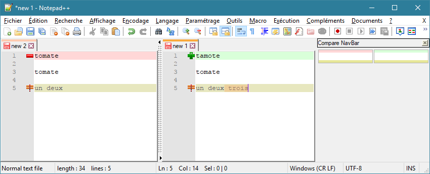

---
plugin:
    name: Compare
    desc: Différences entre deux fichiers
    date: 2011
---
# Compare

Ce [plugin](../plugins.md) permet de déterminer les différences entre deux fichiers ouverts, entre deux versions Git, SVN ou depuis la dernière sauvegarde.

Il a été créé par Ty Landercasper et [Jean-Sébastien Leroy](https://github.com/jsleroy) en 2011 et est développé depuis 2016 par [Pavel Nedev](https://github.com/pnedev).

- <https://github.com/jsleroy/compare-plugin>
- [Tous les contributeurs](https://github.com/jsleroy/compare-plugin/graphs/contributors)

## Installation

Il peut être installé ou désinstallé simplement depuis le [Plugin Manager](plugin-manager.md).

## Utilisation

Compare est accessible depuis le menu *Compléments -> Compare*.

|Option|Raccourci clavier|Description|
|---|---|--|
| *Compare* | <kbd>Ctrl</kbd>+<kbd>Alt</kbd>+<kbd>C</kbd> | Compare le document sélectionné avec le document suivant
| *Set as First to Compare* | <kbd>Ctrl</kbd>+<kbd>Alt</kbd>+<kbd>1</kbd> | Définit le premier document à comparer
| *Clear Active Compare* | <kbd>Ctrl</kbd>+<kbd>Alt</kbd>+<kbd>X</kbd> | "Ferme" la comparaison active et remet en ordre la fenêtre
| *Clear All Compares* | <kbd>Ctrl</kbd>+<kbd>Alt</kbd>+<kbd>Shift</kbd>+<kbd>X</kbd> | "Ferme" toutes les comparaisons
| *Diff since last Save* | <kbd>Ctrl</kbd>+<kbd>Alt</kbd>+<kbd>D</kbd> | Compare le document avec la dernière sauvegarde
| *SVN diff* | <kbd>Ctrl</kbd>+<kbd>Alt</kbd>+<kbd>V</kbd> | Compare le document avec la version courante SVN
| *Git diff* | <kbd>Ctrl</kbd>+<kbd>Alt</kbd>+<kbd>G</kbd> | Compare le document avec la version courante Git

Il affiche alors les deux documents ou versions côte à côte, les synchronise horizontalement et verticalement, affiche un panneau de navigation (*NavBar*) et indique, par le biais de codes couleurs et puces les éléments ajoutés, supprimés ou modifiés :

## Paramètres

Les paramètres sont accessibles depuis le menu *Compléments -> Compare -> Settings*.

