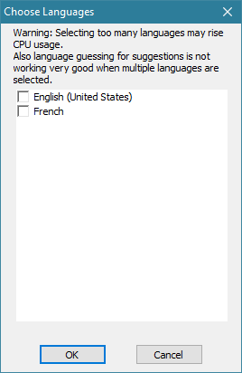
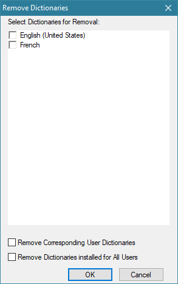
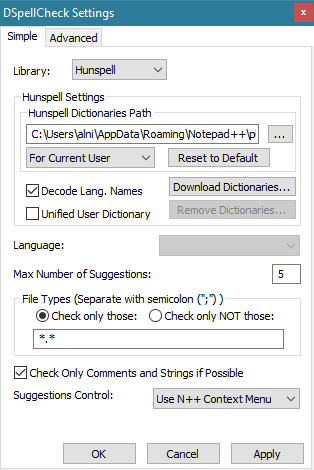

---
plugin:
    name: DSpellCheck
    desc: Correcteur orthographique
    date: 2013
---
# DSpellCheck

Ce [plugin](../plugins.md) intègre un correcteur orthographique à [Notepad++](../notepad++.md).

Il a été créé et est développé depuis 2013 par [Predelnik](https://github.com/Predelnik).

- <https://github.com/Predelnik/DSpellCheck>
- [Manuel en anglais](https://github.com/Predelnik/DSpellCheck/wiki/Manual)

## Installation

Il peut être installé ou désinstallé simplement depuis le [Plugin manager](plugin-manager.md).

## Menu

Le menu est accessible depuis la [barre de menu ](../interface.md#barre-de-menu) *Compléments -> DSpellCheck*, et différentes fonctions sont accessibles par des raccourcis clavier.

Fonction|Raccourci|Description
--|--|--
*Spell check document automatically* | <kbd>Alt</kbd>+<kbd>A</kbd> | Active la correction orthographique
*Find next misspelling* | <kbd>Alt</kbd>+<kbd>N</kbd> | Sélectionne l'erreur suivante
*Find previous misspelling* | <kbd>Alt</kbd>+<kbd>B</kbd> | Sélectionne l'erreur précédente
*Change current language* | <kbd>Alt</kbd>+<kbd>D</kbd> | Ouvre le menu de langues

## Correction orthographique

La correction orthographique des documents peut s'activer :

- Via l'icône `ABC` de la [barre d'outils](../interface.md#barre-doutils)
- Via la [barre de menu](../interface.md#barre-de-menu), *Compléments -> DSpellCheck -> Spell Check Document Automatically*
- Via le [raccourci clavier](../raccourcis-clavier.md) <kbd>Alt</kbd>+<kbd>A</kbd>.

Les erreurs détectées sont soulignées en rouge. Par défaut le menu contextuel (clic droit) affiche la liste des corrections proposées, et permet d'ignorer le mot pour la session en cours ou de l'ajouter  définitivement au dictionnaire.

## Gestion des langues/dictionnaires

Les langues actives et dictionnaires installés se gèrent depuis le menu des langues, accessible :

- via le [raccourci clavier](../raccourcis-clavier.md) <kbd>Alt</kbd>+<kbd>D</kbd>
- via la [barre de menu](../interface.md#barre-de-menu), *Compléments -> DSpellCheck -> Change current language* 
- via le bouton *Download Dictionaries* des préférences *Hunspell*

Chaque langue installée est listée et peut être sélectionnée.

En plus de des langues installées, l'entrée *Multiple Languages* permet d'activer plusieurs langues en même temps, définies dans *Set Multiple Languages* :

### Installer des langues

*Download more languages* affiche la fenêtre de téléchargement des dictionnaires (*Download Dictionaries Dialog*).

Le premier champ est l'addresse comprenant la liste des dictionnaires. Par défaut trois miroirs rattachés à *OpenOffice* sont proposés, hébergés dans différents pays. Il est possible de rajouter une addresse personnalisée, en protocole FTP anonyme et pointant vers une liste de dictionnaires *Hunspell* en `.zip`.

    ftp://ftp.snt.utwente.nl/pub/software/openoffice/contrib/dictionaries/
    ftp://sunsite.informatik.rwth-aachen.de/pub/mirror/OpenOffice/contrib/dictionaries/
    ftp://gd.tuwien.ac.at/office/openoffice/contrib/dictionaries/

Sont listés tous les dictionnaires trouvés à l'addresse courante (uniquement les fichiers dont le nom est reconnu si l'option *Show Only Recognized Ones* est cochée), et la liste peut être réactualisée avec le bouton flêché.

En sélectionnant un ou plusieurs dictionnaires dans la liste et en choisissant *Install Selected*, les fichiers sont téléchargés et installés (pour tous les utilisateurs si *Install for all users* est coché) à l'emplacement indiqué dans les paramètres.

### Désinstaller des langues

*Remove unneeded languages* affiche la fenêtre de suppression des dictionnaires (*Remove Dictionaries*).

En sélectionnant un ou plusieurs dictionnaires dans la liste et en choisissant *OK*, les fichiers sont désinstallés et les fichiers de dictionnaires supprimés si *Remove corresponding user dictionaries* est coché.

## Paramètres simples

Les paramètres sont accessibles via la [barre de menu](../interface.md#barre-de-menu), dans *Compléments -> DSpellCheck -> Settings*.

L'option **Library** permet de sélectionner l'une des deux librairies de correction de texte disponibles : `Hunspell` ou `Aspell`.

La librairie `Hunspell` fonctionne immédiatement, sans autre configuration que la sélection et l'installation de dictionnaires. Le support de la librairie `Aspell` est inclut par l'auteur *au cas où* quelqu'un en ait besoin, mais demande qu'elle soit au préalable installée.

Les options de **Path** permettent de définir le chemin du répertoire d'installation des dictionnaires. il existe deux emplacements gérés par le plugin, qui peuvent être sélectionnés via la liste déroulante : `For Current User` vise le répertoire utilisateur de Windows et `For All Users` vise l'emplacement d'installation de Notepad++, où les dictionnaires peuvent êtres accédés par n'importe quel utilisateur Windows.

    %APPDATA%\Notepad++\plugins\Config\Hunspell
    .\plugins\config\Hunspell

Options Haskell : 

Option|Description
--|--
| *Decode Lang. Names* | Nomme les dictionnaires de façon lisible, par exemple `French` au lieu de `fr_FR`.
| *Unified User Dictionary* | Ajoute chaque mot nouveau dans un dictionnaire unique partagé plutôt que dans un dictionnaire associé à la langue courante.

Autres options :

Option|Description
--|--
| *Language* | Langue sélectionnée pour la correction orthographique (idem que le menu des langues).
| *Max number of suggestions* | Nombre maximum de suggestions proposées au clic droit
| *File types* | Liste blanche (*Only those*) ou liste noire (*NOT those*) d'extensions de fichiers ou de noms de fichiers à corriger. Les carcactères étoile (jokers) sont autorisés.
| *Check only comments and strings* | Ne corrige l'orthographe que dans les chaines de caractères et commentaires des codes sources. Ne fonctionne pas avec les langages utilisateurs.
| *Suggestion Control* | Mode d'affichage des suggestions via un bouton apparaîssant sous les mots ou via le menu contextuel de Notepad++ (clic droit, par défaut).

## Paramètres avancés

