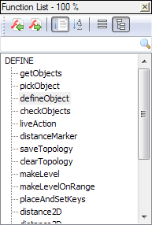

---
plugin:
    name: Function List
    desc: Liste de fonctions
    date: 2007
---
# Function List

Ce [plugin](../plugins.md) permettait de lister, trier et filtrer les fonctions de son programme afin d'y accéder rapidement. Il a été développé entre 2007 et 2010 par Jens Lorenz, avant que le plugin [SourceCookifier](sourcecookifier.md) à partir de 2010, puis la [liste des fonctions](../liste-des-fonctions.md) native de Notepad++ à partir de 2013 n'en recouvrent les fonctionnalités.

Les sources sont disponibles sur [le projet SourceForge](https://sourceforge.net/projects/npp-plugins/files/Function%20List).

## Installation

::: warning Attention
Notepad++ intègre nativement une [Liste des fonctions](../liste-des-fonctions.md) depuis 2013 et la [version 7](../historique-des-versions.md) qui recouvre les fonctionnalités de ce plugin.
:::

Il peut être installé ou désinstallé simplement depuis le [Plugin Manager](plugin-manager.md).

## Utilisation



FonctionList est accessible :

- depuis le menu *Compléments -> Function List*,
- par le raccourci clavier <kbd>Ctrl</kbd><kbd>Alt</kbd><kbd>Shift</kbd><kbd>L</kbd> (par défaut),
- par son icône située en fin de la barre d'outils : 

Il suffit de double-cliquer sur un nom de fonction pour y être ammené.

La première ligne du panneau indique l'état du plugin :

- **100%** : des règles existent pour ce langage, le plugin est opérationnel.
- **No Rule Defined** :  aucune règle n'existe pour ce langage, le plugin ne servira pas.

Si **No Rule Defined** s'affiche pour des langages que le plugin est sencé prendre en compte, c'est qu'il y a un problème avec le fichier de configuration *FunctionListRules.xml* (introuvable, mauvaise version...). Revoir l'étape d'installation.

La barre d'outils contiens les outils suivants :

- **Goto Last Function** : aller en arrière dans l'historique des fonctions observées.
- **Goto Next Function** : aller en avant dans l'historique des fonctions observées.
- **Sort in Sequence** : trier les fonctions selon leur place dans le fichier.
- **Sort Alphabetically** : trier les fonctions par ordre alphabétique.
- **View as List** : Afficher les fonctions en liste, à la suite.
- **View as Tree** : Afficher les fonctions en arbre, groupées selon leur type (INCLUDE, FUNCTION, DEFINE...). Double-cliquer sur un groupe pour l'ouvrir ou le fermer.

## Ajouter des règles

Il est possible de créer ses propres règles par le biais de la fenêtre *Compléments -> Function List -> Language Parsing Rules...*, ou en modifiant manuellement le fichier *FunctionListRules.xml* (voir l'emplacement des fichiers de configuration dans le chapitre [plugins](../plugins.md)).

La création de règles vous demandera une connaissance de base des [expressions régulières](../expressions-regulieres.md).

Pour rajouter la prise en compte des classes en Python, il suffit par exemple de créer un nouveau groupe similaire au groupe FUNCTIONS, en remplaçant le mot **def** dans *Function Begin* par **class**.


Cette configuration est toute fois très limitée, les fonctions de premier niveau et les méthodes de classes étant mêlées. Pour une configuration plus complète du langage python, vous pouvez remplacer le nœud en question dans le fichier de configuration par celui-ci :

```xml
<Language name="Python" imagelistpath="">
    <CommList param1="#" param2="" />
    <Group name="GlobalFunction" subgroup="Function" icon="0" child="0" autoexp="4" matchcase="1" fendtobbeg="" bbegtobend="" keywords="">
        <Rules regexbeg="^def\s+" regexfunc="[\w_]+" regexend="" bodybegin="" bodyend="" sep="" />
    </Group>
    <Group name="Class" subgroup="Function" icon="0" child="0" autoexp="4" matchcase="1" fendtobbeg="" bbegtobend="" keywords="">
        <Rules regexbeg="^class\s+" regexfunc="[\w_]+" regexend="" bodybegin="" bodyend="" sep="" />
    </Group>
    <Group name="Function" subgroup="" icon="0" child="0" autoexp="4" matchcase="1" fendtobbeg="" bbegtobend="" keywords="">
        <Rules regexbeg="^[\s\t]+def\s+" regexfunc="[\w_]+" regexend="" bodybegin=":" bodyend="$" sep="" />
    </Group>
</Language>
```

Pour actualiser les changements, sélectionnez un autre langage, cliquez sur *Try!*, sélectionnez Python et cliquez sur *Try!*.
