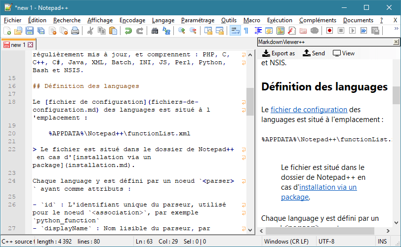

---
plugin:
    name: MarkdownViewer++
    desc: Visualiseur Markdown
    date: 2017
---
# MarkdownViewer++

Ce [plugin](../plugins.md) permet de visualiser et synchroniser le résultat d'un fichier Markdown, et de l'exporter en HTML ou PDF.

Il a été créé par [Savas Ziplies](https://github.com/nea).

- <https://github.com/nea/MarkdownViewerPlusPlus>

## Installation

Il peut être installé ou désinstallé simplement depuis le [Plugin Manager](plugin-manager.md).

## Utilisation

Le panneau de visualisation peut être affiché via le menu *Compléments -> MarkdownViewer++*, par le [raccourci clavier](raccourcis-clavier.md) <kbd>Ctrl</kbd><kbd>Shift</kbd><kbd>M</kbd> ou par l'icône `M` de la [barre d'icônes](barre-dicones.md).

Le panneau permet via *Export as* d'enregistrer le résultat au format HTML ou PDF, et via *Send* d'envoyer le résultat à une imprimante ou de le copier dans le presse papier.

L'option *Synchronize scrolling* dans le menu *Compléments -> MarkdownViewer++* permet de synchroniser l'affichage du panneau avec la vue courante de la zone d'édition.

## Paramètres

Les paramètres sont accessibles via le menu *Compléments -> MarkdownViewer++ -> Options*.

La partie *General* permet de configurer les extensions pour lesquelles le plugin est actif.

*File extensions* est une liste d'extensions de fichiers (sans le point), séparées par des virgules. Par exemple `txt,log,md`. Si le champ est vide, tous les fichiers seront inclus (par défaut).

Les parties *HTML* et *PDF* permettent de configurer les exports du document, en définissant du CSS personnalisé ou les paramètres de pages : orientation, format et marges. Chaque export peut être ouvert automatiquement avec *Open after export*.