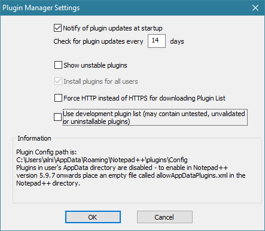

---
plugin :
    name: Plugin manager
    desc: Gestionnaire de plugins
    date: 2009
---
# Plugin manager

Ce [plugin](../plugins.md) est un gestionnaire de plugins. Il permet d'installer, supprimer et mettre à jour en quelques clics les plugins disponibles pour [Notepad++](../notepad++.md). Créé et développé depuis 2009 par Dave Brotherstone, il était proposé par défaut dans Notepad++ de 2009 à 2017.

::: warning Attention
L'inclusion en [septembre 2016](https://github.com/bruderstein/nppPluginManager/commit/63af96b59e7105047790bed016b71d2dd709dd55) d'une publicité (voir  [Plugin Manager Sponsoring](https://bruderste.in/npp/pm/sponsor/)) a entraîné son retrait des plugins inclus par défaut à partir d'août 2017 et de la [version 7.5](../historique-des-versions.md). Un gestionnaire de plugins natif a commencé à être développé dans la foulée sous le nom de *Plugin Admin* (voir [commits](https://github.com/notepad-plus-plus/notepad-plus-plus/search?q=Plugin+Admin&type=Commits&utf8=%E2%9C%93)).
:::

Les sources du plugin, releases et informations sont disponibles sur le [projet GitHub](https://github.com/davegb3/nppPluginManager).

## Installation

Depuis la [version 7.5](../historique-des-versions.md) le Plugin Manager n'est plus inclus par défaut et doit être téléchargé et installé manuellement.

<Button text="Télécharger la dernière version" href="https://github.com/bruderstein/nppPluginManager/releases/latest" class="blue"></Button>

Décompresser l'archive, et copier son contenu (`plugins/PluginManager.dll` et `updater/gpup.exe`) dans le répertoire d'installation de Notepad++. Par exemple à l'adresse :

    C:\Program Files\Notepad++

Relancer Notepad++.

::: tip Astuce
Il est aussi possible d’installer le Plugin Manager à partir de lui-même en n'ajoutant préalablement que le fichier `dll` au dossier `plugins` !
:::

## Interface

Pour afficher la fenêtre, utiliser le menu *Compléments -> Plugin Manager -> Show Plugin Manager*.

- *Available* : Le premier onglet liste les plugins existants, et permet de les installer.
- *Updates* : Le deuxième onglet indique les mises à jour de plugins existantes.
- *Installed* : Le troisième onglet liste les plugins installés et permet de les supprimer ou de les réinstaller.

## Options

La fenêtre d'options est accessible depuis le bouton *Settings* en bas du Plugin Manager.

- `Notify of plugin updates at startup` active la recherche de mises à jour de plugins au démarrage de Notepad++, et le cas échéant affiche un message.
- `Show unstable plugins` permet d'ajouter les plugins en cours de développement ou instables à la liste de plugins disponibles.
