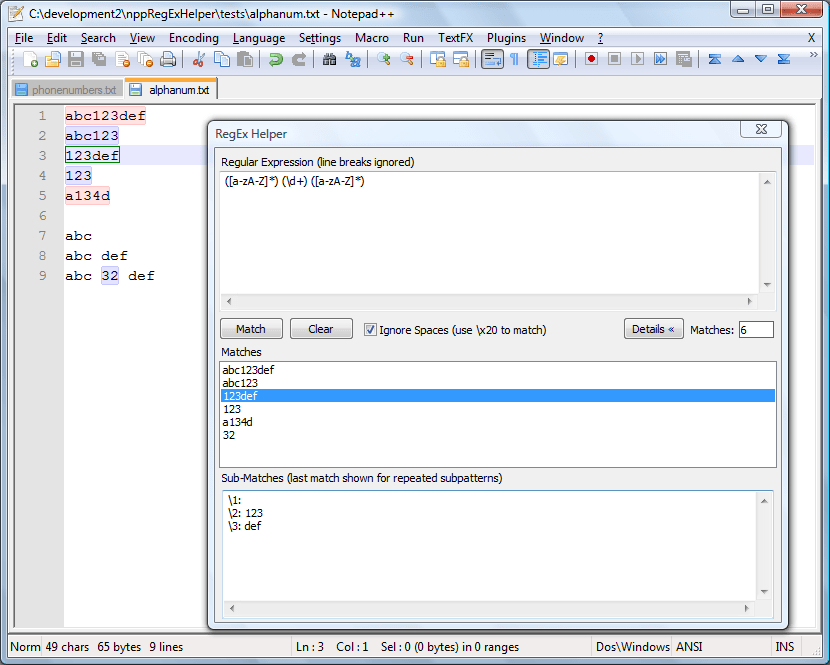

---
plugin:
    name: RegEX Helper
    desc: Résultats avancés d'expressions régulières
    date: 2009
    tags: ['expreg']
---
# RegEX Helper

Ce [plugin](../plugins.md) facilite grandement l'utilisation des [expressions régulières](../expressions-regulieres.md) en listant et surlignant dans le texte les correspondances d'un motif, ainsi que les résultats des groupes du motif.

Il a été créé par [Lawrence Barsanti](http://lawrencebarsanti.wordpress.com).

- <http://nppregexhelper.sourceforge.net>

## Installation

Il peut être installé ou désinstallé simplement depuis le [Plugin Manager](plugin-manager.md).

## Utilisation

La fenêtre du RegEx Helper peut être affichée :

- par le menu *Compléments -> RegEx helper -> Launch*,
- par le raccourci clavier <kbd>Ctrl</kbd>+<kbd>f12</kbd>.

Le premier champ permet d'écrire les [expressions régulières](expressions-regulieres.md), le bouton *Match* d'effectuer la recherche, le bouton *Details* d'afficher la liste des résultats.

Les résultats sont alors surlignés dans le texte (alternativement colorés en rose et bleu, et le résultat sélectionné en vert) et listés dans le champ *Matches*. La sélection d'un résultat dans la liste affiche le contenu des groupes du motif dans le champ *Sub-Matches*.
