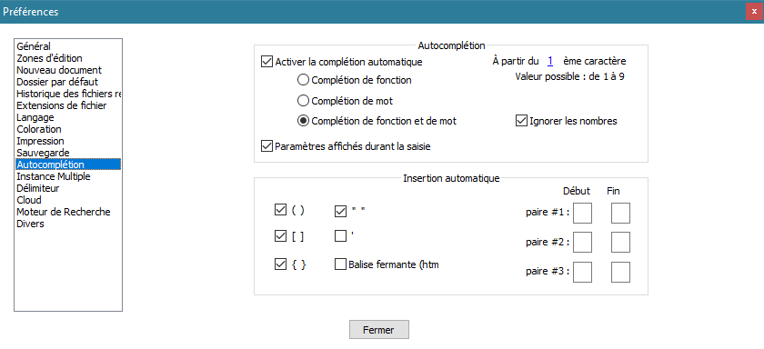
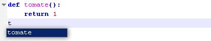

# Autocomplétion

[Préférences](../preferences.md) d'auto-complétion et d'insertion automatique de [Notepad++](../notepad++.md).

## Auto-complétion

Une liste de suggestions (complétions) basées sur le début du mot tapé peuvent être affichées avec le [raccourcis clavier](../raccourcis-clavier.md) <kbd>Ctrl</kbd>+<kbd>Espace</kbd>, et être insérée en validant une proposition.

La préférence *Activer la complétion automatique* active l'affichage des propositions dès l'écriture, sans [raccourci clavier](../raccourcis-clavier.md), dès qu'un nombre de caractères définis par *À partir du x è caractère* a été tapé.

La *Complétion de fonction* propose les fonctions connues du langage utilisé.

La *Complétion de mot* propose les mots existant dans le fichier.

Les *Paramètres affichés durant la saisie* affiche la définition de la fonction saisie.

## Insertion automatique

L'élément fermant d'une paire logique est inséré automatiquement au moment de la saisie de l'élément ouvrant.

Les options permettent d'activer ou désactiver cette fontion pour les parenthèses, les crochets, les accolades, les guillemets simples et doubles et les balises HTML, ainsi que de définir des paires personnalisées.

Pour éviter de créer des caractères en double en cas d'oubli de cette fonctionnalité, si l'utilisateur saisit l'élément fermant alors qu'il vient d'être inséré automatiquement, le caractère inséré automatiquement est supprimé.