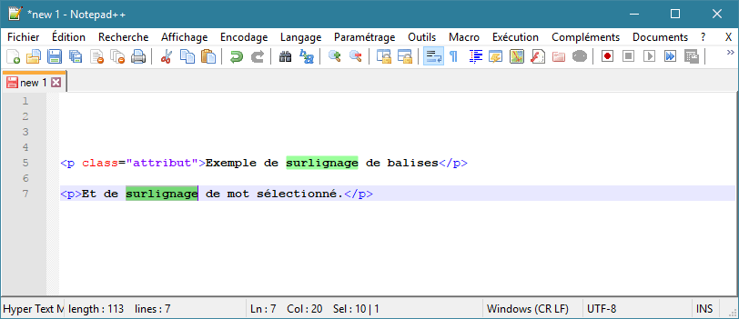

# Coloration

[Préférences](../preferences.md) de coloration contextuelle de [Notepad++](../notepad++.md).

## Coloration de mot

Permet d'activer et régler la [coloration des mots sélectionnés](../coloration-automatique.md#Coloration-de-mots).

|*Activer le coloriage automatique*|Active la [coloration des mots sélectionnés](../coloration-automatique.md#Coloration-de-mots)|
|*Sensible à la casse*|Prend en compte les majuscules et minuscules pour différencier les mots|
|*Mot entier uniquement*|N'active la coloration que pour les sélections de mots, pas de caractères. La définition d'un "mot" peut être réglée dans les [préférences de délimiteur](delimiteur.md)|
|*Utiliser les paramètres de recherche*|
|*Sur l'autre vue également*|Colore les mots correspondants également sur l'autre vue en mode "deux vues"|

## Coloration de balises

Permet d'activer et régler la [coloration des balises](../coloration-automatique.md#Coloration-de-balises) XML/HTML.

*Les attributs de tag* active la coloration des attributs des balises, par exemple `class=""`.

*Dans la zone commentaire* active la coloration dans les commentaires PHP/ASP.