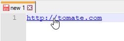

# Préférences diverses

[Préférences](../preferences.md) diverses de [Notepad++](../notepad++.md).

## Commutateur de document

Cette option permet d'activer le [mini commutateur de document](../commutateur-de-document.md). En la désactivant, les [raccourcis clavier](../raccourcis-clavier.md) <kbd>Ctrl</kbd>+<kbd>Tab</kbd> et <kbd>Ctrl</kbd>+<kbd>Shift</kbd>+<kbd>Tab</kbd> passeront directement d'un onglet à l'autre.

*Activer la liste de MRU* affiche la liste des derniers fichiers manipulés plutôt que la liste des documents ouverts.

## Document Peeker

Cette option permet d'activer l'[aperçu de document](../apercu-de-document.md) au survol de la [barre d'onglets](../interface.md#barre-donglets) ou du [Plan du document](../plan-du-document.md).

## Paramétrage de lien cliquable

Ces paramètres permettent de rendre cliquable les URLs dans le texte d'un fichier, et de les souligner ou non.

## Autodétection de l'état des fichiers

- *Détection automatique*
- *Mise à jour sans alerte* 
- *Aller à la dernière ligne après mise à jour*

## Autres

- *Détecter l'encodage automatiquement*
- *Indentation automatique*
- *Réduire dans la barre de notifications*
- *Afficher le nom du fichier seulement sur la barre de titre*
- *Backslash : caractère d'échappement pour SQL*
- *Activer la mise à jour automatique*

Les paramètres *Extension fichier Session* et *Extension fichier Espace de travail* permettent de définir une extension personnalisée pour ces fichiers de travail.