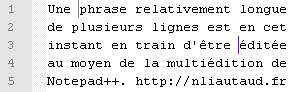

# Zone d'édition

[Préférences](../preferences.md) du comportement de certaines fonctionnalités relatives à l'édition dans [Notepad++](../notepad++.md).

## Curseur

*Largeur* du curseur d'édition : 

Largeur|Description
--|--
*0*|curseur invisible
*1*|curseur large de 1 pixel (par défaut)
*2*|curseur large de 2 pixels
*3*|curseur large de 3 pixels
*Block*|curseur large d'un caractère (type ligne de commande)

Vitesse de *cligotement* du curseur :

Clignotement|Description
--|--
*vif*|cinq clignotements par seconde
*zen*|un clignotement toute les quatre secondes (placer le curseur entièrement à droite pour stopper le clignotement)

## Multiédition

Cette option permet d'activer l'édition simultanée d'emplacements différents dans un fichier.

Il est alors possible de faire des sélections ou de positionner le curseur à autant d'emplacements que voulus en utilisant la touche <kbd>Ctrl</kbd>+`Clic gauche`.

Une fois le curseur multiplié, il est possible d'écrire, effacer, couper, copier, coller, etc... depuis tous ces endroits à la fois. Les parties copiées seront mises bout à bout au moment de coller.

## Contrôle de repli de bloc

Notepad++ indique et permet de replier les blocs d'instruction en affichant des repères dans la barre verticale située à gauche du texte. Ces options permettent d'en choisir le style.

Option|Description
--|--
*Simple*|Affiche un signe "-" ou "+" en début de bloc
*Flèche*|Affiche une flèche orientée en début de bloc
*Cercle*|Marque le bloc sur toute sa hauteur, en commençant par un cercle
*Carré*|Marque le bloc sur toute sa hauteur, en commençant par un carré
*Aucun*|Cache la barre de blocs

## Largeur des lignes

Option|Description
--|--
*Afficher la marge droite*|Active l'indication de longueur de ligne
*Afficher un filet vertical*|Affiche une ligne à la colonne donnée
*Colorer l'arrière plan*|Colore le fond du texte jusqu'à la colonne donnée
*Nombre de colonnes*|Emplacement du repère

## Largeur de la bordure

Permet de définir l'importance de la bordure autour de la [zone d'édition](../interface.md#zone-dedition), ou de la désactiver.

## Line pliée

Comportement des retours à la ligne automatiques activés dans *Affichage -> Retour automatique à la ligne*.

Option|Description
--|--
*Défaut*|le morceau coupé s'aligne au début de la fenêtre. 
*Aligné*|le morceau coupé se place au même niveau que le début de la ligne. 
*Indenté*|le morceau coupé se place à un niveau d'indentation supérieur à la ligne. 

## Autres options

Option|Description
--|--
*Afficher la numérotation des lignes*|Affiche/cache la barre verticale indiquant les numéros de lignes
*Afficher la marge de signet*|Affiche/cache la barre verticale indiquant et permettant d'ajouter ou supprimer des signets
*Surligner la ligne actuelle*|Affiche un fond coloré sous la ligne active
*Activer le Smooth Font*|Active e lissage des polices
*Activer le défilement au delà de la dernière ligne*|Permet de faire défiler le texte jusqu'à avoir la dernière ligne en haut de la zone d'édition, au lieu de stopper en bas
*Désactiver le défilement avancé*|Permet de résoudre de rares problèmes avec les pavés tactiles
