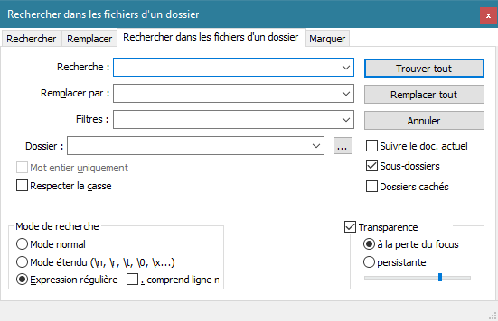

# Recherches et remplacements

Un des gros plus de Notepad++ est sa gestion des recherches et remplacements. Utiliser ces fonctionnalités systématiquement fais gagner un temps précieux, surtout avec la maîtrise des [expressions régulières](expressions-regulieres.md).

::: tip Astuce
A l'ouverture de la fenêtre, le champ de recherche est pré-rempli par le texte sélectionné ou le mot situé sous le curseur.
:::

## Rechercher

L'onglet de recherche de la fenêtre de recherches/remplacements s'ouvre depuis :

- Le menu *Recherche -> Recherche*,
- Le raccourci clavier <kbd>Ctrl</kbd>+<kbd>F</kbd>,
- L'icône  dans la barre de menu.

- `Suivant` sélectionne l'occurrence suivante
- `Compter` compte le nombre d'occurrences
- `Rechercher dans tous les documents ouverts` affiche les résultats de la recherche dans tous les onglets
- `Rechercher dans le document actuel` affiche les résultats de la recherche dans l'onglet actif

### Options de recherche

- `Rechercher vers l'arrière` *Suivant* se comportera comme un bouton *Précédent*
- `Mot entier uniquement` limite la recherche aux éléments séparés du reste par un espace
- `Respecter la casse` fait une différenciation entre les majuscules et les minuscules
- `Boucler` permet de revenir de l'autre côté une fois le bout du document atteint

Certaines options ne sont pas disponibles et grisées selon le mode de recherche actif.

### Mode de recherche

- `Mode normal` le texte est recherché tel quel
- `Mode étendu` certains caractères spéciaux sont autorisés
- `Expression régulière` rechercher au moyen  d'[expressions régulières](expressions-regulieres.md).

## Remplacer

L'onglet de remplacement de la fenêtre de recherches/remplacements s'ouvre depuis :

- Le menu *Recherche -> Remplacer*,
- Le raccourci clavier <kbd>Ctrl</kbd>+<kbd>H</kbd>,
- L'icône  dans la barre de menu.

- `Suivant` sélectionne l'occurrence suivante, sans faire de remplacement
- `Remplacer` remplace l'occurence courante
- `Remplacer tout` recherche et remplace toutes les occurences dans le document actif
- `Remplacer dans tous les documents ouverts` recherche et remplace toutes les occurences dans tous les documents ouverts

Les options sont identiques aux [options de recherche](#options-de-recherche).

## Rechercher dans les fichiers d'un dossier

L'onglet de recherche de la fenêtre de recherches/remplacements s'ouvre depuis :

- Le menu *Recherche -> Rechercher dans les répertoires*,
- Le raccourci clavier <kbd>Ctrl</kbd>+<kbd>Shift</kbd>+<kbd>f</kbd>,

- `Recherche` élément à rechercher
- `Remplacer par` élément de remplacement
- `Filtres` limiter aux fichiers correspondant au filtre
- `Dossier` dossier dans lequel rechercher

### Options de recherche de dossier

- `Suivre le doc. actuel` rechercher à l'emplacement du document actuel
- `Sous-dossiers` effectue une recherche récursive dans les sous-dossiers
- `Dossiers cachés` inclue les dossiers cachés par Windows

Certaines options sont identiques aux [options de recherche](#options-de-recherche).

## Marquer

L'onglet de marquage de la fenêtre de recherches/remplacements s'ouvre depuis :

- Le menu *Recherche -> Marquer...*
- L'onglet *Marquer* de la fenêtre

- `Rechercher tout` colore tous les résultats de recherche du document
- `Purger` supprime les résultats colorés et les marques de lignes

### Options de marquage

- `Marquer les lignes` ajoute un marqueur à chaque ligne comprenant un résultat de recherche
- `Purger à chaque fois` supprime les résultats colorés et les marquages précédents lors d'une nouvelle recherche
- `Dans sélection` applique la recherche à la zone zélectionnée

Certaines options sont identiques aux [options de recherche](#options-de-recherche).

## Résultats de recherche

La fenêtre des résultats de recherche s'ouvre automatiquement après une première recherche effectuée, et peut se réouvrir ensuite depuis :

- Le menu *Recherche -> Fenêtre des résultat de recherche*
- Le raccourci clavier <kbd>F7</kbd>

Elle s'affiche en pied de page et indique le fichier, les lignes et l'emplacement dans la ligne. Chaque résultat ou chaque groupe de résultats peut se dérouler/enrouler en cliquant sur les petits "-" à gauche.

Double-cliquer sur un résultat de recherche place le curseur à son emplacement.