# Interface

Notepad++ se compose d'une fenêtre unique dont la plupart des éléments peuvent être cachés, déplacés ou paramétrés. Si tous les éléments de son interface ont été cachés et toutes les fonctions avancées désactivées, Notepad++ se limite à une zone d'édition blanche.

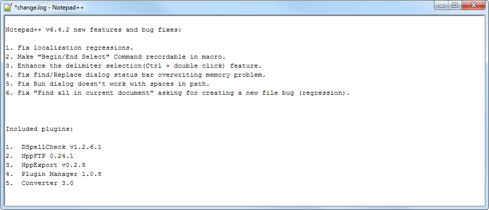

En affichant ses barres et panneaux, en activant ses [options diverses](preferences/divers.md) et en changeant de [thème](themes.md) l'interface peut-être plus complexe.

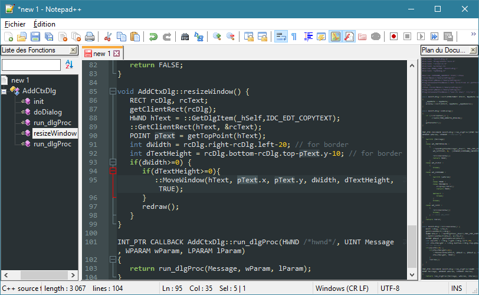

Ce n'est pas pour rien que l'icône est un caméléon.

## Barre de menu

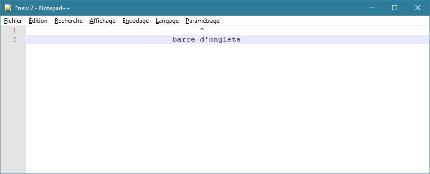

La barre de menu permet d'accéder aux fenêtres et fonctions de Fichier, d'Édition, de Recherche, d'Affichage, d'Encodage, de Langage, de Paramétrage, d'Outils, de Macro, d'Exécution, de Compléments, de Documents et d'Information.

Elle peut être cachée via les [préférences générales](preferences/general.md), et s'affichera à l'appui sur la touche <kbd>Alt</kbd> ou <kbd>F10</kbd>.

## Barre d'outils

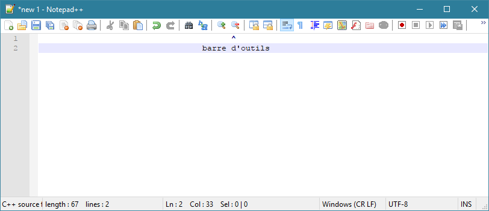

La barre d'outils est la barre supérieure composée d'icônes, raccourcis vers certaines fonctions de base. Toutes ces fonctions sont accessibles via des [raccourcis clavier](raccourcis-clavier.md) ou via la barre de menu.

Elle peut être cachée et paramétrée dans les [préférences générales](preferences/general.md).

- Créer, ouvrir, enregistrer, fermer ou imprimer des documents.
- Couper, copier, coller la sélection.
- Annuler ou rétablir des modifications.
- [Rechercher et remplacer](recherches-et-remplacements.md).
- Zommer/dézommer.
- Synchroniser le défilement entre les vues.
- Activer les retours à la ligne, afficher les caractères d'espacement, les guides d'indentation ou définir le langage.
- Afficher le [Plan du document](plan-du-document.md), la [Liste des fonctions](liste-des-fontions.md), le [Dossier de travail](dossier-de-travail.md) ou la [Surveillance de logs](surveillance-de-logs.md).
- Enregistrer, exécuter ou enregistrer des [macros](macros.md).

Elle peut en plus afficher des fonctionnalités liées aux [plugins](plugins.md).

## Zone d'édition

Il est possible de personnaliser certains détails et fonctionnalités dans les [préférences de zone d'édition](preferences/edition.md).

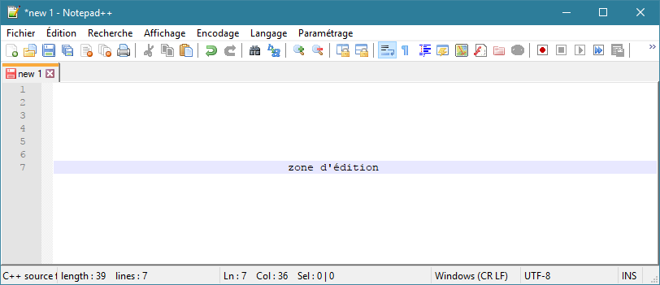

La zone d'édition peut être scindées en deux vues distinctes, à la manière d'un split-screen vertical, chaque partie pouvant acceuillir des documents différents ou le clone d'un document. Un document cloné dans une autre vue pourra être observé et édité de deux endroits en même temps.

*Affichage* -> *Déplacer/cloner le document actuel*

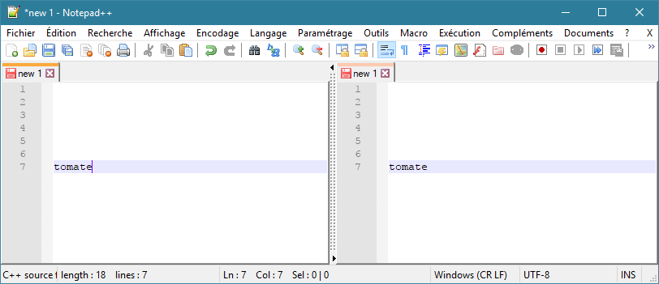

La séparation entre les deux vues peut être déplacée avec la souris pour laisser plus d'espace à l'une ou l'autre.

### Délimiteurs jumeaux

Lorsqu'un délimiteur du langage est sélectionné, comme un crochet, une parenthèse ou l'accolade d'une instruction, il se colore en rouge et son jumeau ouvrant ou fermant aussi. Si le délimiteur jumeau est manquant, l'élément sélectionné ne se colorera pas.

Dans le cas d'une accolade dans un langage de type C une ligne de pointillé rouge indique son niveau d'indentation, et dans le cas d'un [langage de balisage](https://fr.wikipedia.org/wiki/Langage_de_balisage) les balises d'ouverture et de fermeture correspondantes se colorent aussi.

|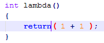|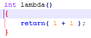|
|Parenthèses|Accolades|

## Barre d'onglets

Les onglets peuvent être glissés-déposés au sein de la barre d'onglets pour être réorganisés, glissés-déposés dans les vues pour créer ou changer de vue, et glissés-déposés en dehors du logiciel pour changer d'instance de Notepad++.

Une partie des [préférences générales](preferences/general.md) lui est dédiée.

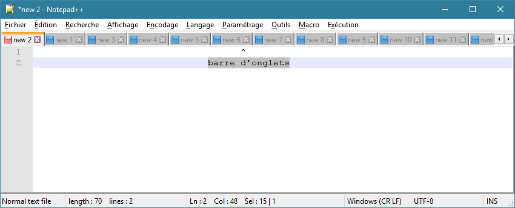

Pour une meilleure visibilité, l'onglet actif est par défaut surplombé d'une fine barre orange et les onglets inactifs sont assombris.

L'icône de disquette précédant le nom du fichier sur un onglet indique l'état de sauvegarde du fichier. Si la disquette est bleue les dernières modifications ont été enregistrées, si elle est rouge c'est que le fichier a été modifié depuis la dernière sauvegarde. Cette indication n'est pas une analyse comparative du contenu réel du fichier, mais simplement un rappel basé sur les actions d'édition. Ajouter un espace puis le supprimer indiquera par exemple une disquette rouge, alors que le contenu du fichier est identique.

Lorsqu'il y a plus d'onglets que la largeur de la fenêtre ne puisse afficher deux boutons droite/gauche apparaissent pour les faire défiler. L'option "multiligne" des [préférences générales](preferences/general.md) remplace ce comportement par l'affichage des onglets sur plusieurs lignes.

Le [Commutateur de document](commutateur-de-document.md) est une autre forme d'affichage des documents ouverts qui peut potentiellement remplacer la barre d'onglet, pour gagner de la place sur la zone d'édition ou gérer un plus grand nombre de documents.

## Barre d'état

La barre d'état est la barre inférieure contenant des informations sur le document actuel et la sélection. Elle ne peut pas être redimensionnée ou déplacée, et peut être désactivée dans les [préférences générales](preferences/general.md).

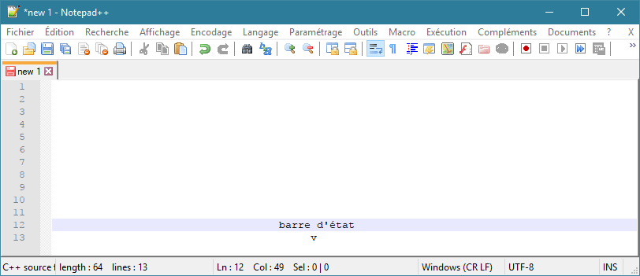

Elle est scindée en plusieurs parties qui indiquent, de la gauche vers la droite :

- Le type de fichier/langage
- le nombre de bits et le nombre de lignes
- la position du curseur (ligne et colonne) et le nombre de caractères sélectionnés
- le type de retours à la ligne (UNIX, Mac, Windows)
- le type d'encodage du fichier (UTF8, ANSI, etc.)
- le mode de curseur (insertion ou écrasement)

### Fichier/language

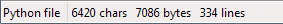

Il est possible de définir le type de langage du document en utilisant le menu *Langage* ou en ouvrant/enregistrant un fichier (détection de l'extension).

Le langage par défaut d'un nouveau document est définit dans la partie [Nouveau document](preferences/nouveau-document.md) des [préférences](preferences.md).

### Formats de saut de ligne, encodage et mode de curseur

Il est possible de changer le type d'encodage du document à la volée en utilisant le menu *Encodage*.

Le type d'encodage et le format des sauts de ligne par défaut d'un nouveau document est définit dans la partie [Nouveau document](preferences/nouveau-document.md) des [préférences](preferences.md).

## Panneaux

En dehors de la zone d'édition, certaines interfaces prennent place dans des panneaux modulables. C'est souvent le cas des [plugins](plugins.md), ou de fonctionnalités alternatives comme la [Liste des fonctions](liste-des-fonctions.md) ou la [Gestion de projet](gestion-de-projet.md).

Ces panneaux peuvent-être glissés-déposés via leur barre de titre. En approchant un bord de la fenêtre, ils peuvent être placés de chaque côté de la zone d'édition, horizontalement ou verticalement, et peuvent ensuite être redimensionnés en tirant leur bord intérieur. En les glissant à un autre endroit ils deviennent flottants et peuvent être placés n'importe où, au-dessus de la fenêtre principale ou en dehors.

Lorsque deux panneaux sont placés au même endroit une barre d'onglets spécifique permet de choisir celui à afficher.

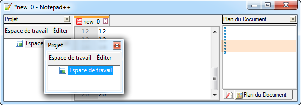
