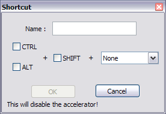
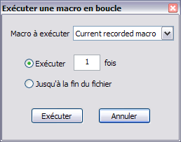

# Macros

Une macro est l'enregistrement d'une suite d'actions. Une macro peut être exécutée, toutes les actions enregistrées sont alors effectuées automatiquement.


## Créer une macro

L'enregistrement des actions peut être lancé...

- Par le menu *Macro -> Démarrer l'enregistrement*,
- Par le raccourci clavier <kbd>Ctrl</kbd>+<kbd>Shift</kbd>+<kbd>r</kbd>,
- Par l'icône  de la barre de menu.

...et peut être stoppé :

- Par le menu *Macro -> Arrêter l'enregistrement*,
- Par le raccourci clavier <kbd>Ctrl</kbd>+<kbd>Shift</kbd>+<kbd>r</kbd>,
- Par l'icône  de la barre de menu.

Les actions de la souris ne sont pas enregistrées.

## Enregistrer une macro

Une fois la macro créée, il est possible (mais pas obligatoire) de l'enregistrer afin de la réutiliser plus tard ou de l'associer à un raccourci clavier.

La fenêtre *Shortcut*, permettant d'enregistrer une macro, peut être ouverte :

- Depuis le menu *Macro -> Enregistrer la macro*,
- Par l'icône  de la barre de menu.



Pour seulement enregistrer votre macro, vous n'avez qu'à lui donner un nom et valider. Vous pouvez aussi lui associer un raccourci clavier en remplissant la seconde partie de la fenêtre

## Renommer une macro

Vous pouvez renommer une macro enregistrée ou modifier son raccourci clavier depuis l'onglet *Macros* du gestionnaire de raccourcis : *Macro -> Modifier/Supprimer Macro*. Double-cliquez sur une entrée ou utilisez le bouton *Modify* pour ouvrir la fenêtre d'édition de raccourci.

## Supprimer une macro

Pour supprimer une entrée, faites un clic droit sur la macro visée et sélectionnez *Delete*, ou sélectionnez une macro et cliquez sur le bouton *Delete*.

## Exécuter une macro

### Une fois

Une fois la macro créée, il est possible de l'exécuter :

- Par le menu *Macro -> Rejouer la macro*,
- Par le raccourci clavier <kbd>Ctrl</kbd>+<kbd>Shift</kbd>+<kbd>p</kbd>,
- Par l'icône  de la barre de menu.

Les macros enregistrées sont directement listées dans le menu *Macro*.

### En boucle

C'est dans cette possibilité que réside l'intérêt des macros : la répétition d'une action un grand nombre de fois sans effort.

La fenêtre *Exécuter une macro en boucle* peut être ouverte depuis le menu *Macro -> Exécuter une macro en boucle...*, ou par l'icône  de la barre de menu.



- **Macro à exécuter** : choisissez ici une macro que vous avez enregistrée auparavant, ou *Current recorded macro* pour la dernière macro créée.
- **Exécuter x fois** : sélectionnez cette option pour exécuter la macro un certain nombre de fois.
- **Jusqu'à la fin du fichier** : sélectionnez cette option pour exécuter une macro jusqu'à la fin du fichier, si la fin peut être atteinte (une macro qui *n'avance pas* dans le fichier ne sera exécutée qu'une fois).

## Exemples

On pourrait :

- [Supprimer des retours à la ligne](supprimer-des-retours-a-la-ligne.md)
- [Insérer du texte](inserer-du-texte.md)

Pour l'exemple le plus simple, aidons un cancre à qui la maîtresse a ordonnée de recopier cent fois :

    Je ne dois pas dessiner pendant la classe.

Si la chose est tout à fait ennuyeuse à faire sur un cahier de classe, rien n'est plus aisé en utilisant une macro.

Pour créer notre macro, on...

- lance l'enregistrement au moyen de <kbd>Ctrl</kbd>+<kbd>Shift</kbd>+<kbd>r</kbd>,
- écrit notre phrase,
- appuie sur `Entrée` pour revenir à la ligne,
- stoppe l'enregistrement au moyen de <kbd>Ctrl</kbd>+<kbd>Shift</kbd>+<kbd>r</kbd>.
- efface notre phrase (pour ne pas la recopier 101 fois!).

Et pour l'exécuter cent fois, on...

- ouvre la fenêtre *Exécuter une macro en boucle* depuis le menu *Macro*,
- sélectionne la première option en rentrant *100*,
- clique sur *OK*.

## Modification du XML

Il est possible de modifier les actions effectuées par les macros en modifiant manuellement le fichier correspondant des [Fichiers de configuration](fichiers-de-configuration.md).

    %APPDATA%/Notepad++/shortcuts.xml

Les macros y sont décrites par des balises `<Macro>` à l'intérieur de la balise principale `<Macros>`. Leur format est décrit ici : [Editing Configuration Files](https://sourceforge.net/apps/mediawiki/notepad-plus/index.php?title=Editing_Configuration_Files#.3CMacros.3E).

La seule macro par défaut est *Trim Trailing and save* :

```xml
<Macro name="Trim Trailing and save" Ctrl="no" Alt="yes" Shift="yes" Key="83">
    <Action type="1" message="2170" wParam="0" lParam="0" sParam=" " />
    <Action type="1" message="2170" wParam="0" lParam="0" sParam=" " />
    <Action type="1" message="2170" wParam="0" lParam="0" sParam=" " />
    <Action type="0" message="2327" wParam="0" lParam="0" sParam="" />
    <Action type="0" message="2327" wParam="0" lParam="0" sParam="" />
    <Action type="2" message="0" wParam="42024" lParam="0" sParam="" />
    <Action type="2" message="0" wParam="41006" lParam="0" sParam="" />
</Macro>
```

Chaque action est définie par un attribut *message* correspondant à un code Scintilla, défini dans le fichier de configuration de Scintilla [Scintilla.iface](http://scintilla.cvs.sourceforge.net/viewvc/scintilla/scintilla/include/Scintilla.iface).
