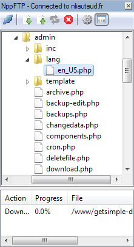
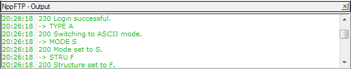
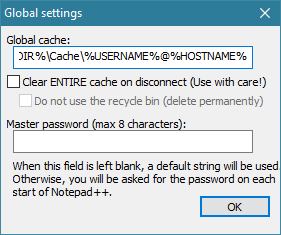
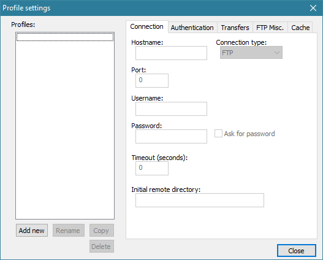

---
plugin:
    name: NppFTP
    desc: Client FTP
    date: 2010
---
# NppFTP

Ce [plugin](../plugins.md) intègre un client FTP au sein de [Notepad++](../notepad++.md) permettant d'éditer "en temps réel" des fichiers distants, voire de synchroniser des projets.

Il a été créé par [Harrybharry](http://sourceforge.net/users/harrybharry), et est développé par [Ashish Kulkarni](https://github.com/ashkulz) et [Christian Grasser](https://github.com/chcg) ([tous les contributeurs](https://github.com/ashkulz/NppFTP/graphs/contributors)).

- <https://ashkulz.github.io/NppFTP>
- <https://github.com/ashkulz/NppFTP>

## Installation

Il peut être installé ou désinstallé simplement depuis le [Plugin Manager](plugin-manager.md).

## Interface

L'interface comprend un panneau principal et un panneau d'affichage des messages.

### Panneau principal



Il peut être affiché :

- Par le menu *Compléments -> NppFTP -> Show NppFTP Window*,
- Par l'icône  située à droite de la barre d'icônes.

Par défaut ce panneau est présent sur le côté droit de Notepad++. Bien que pouvant être placé n'importe où la structure de son contenu impose une disposition verticale, il vaut donc mieux le placer à droite, à gauche ou le détacher.

La barre de menu, composée d'icônes uniquement, comprend les fonctions suivantes :

-  `(Dis)Connect` permet de se connecter à l'un des profils de connexion listés ou de se déconnecter du profil actuel.
-  `Download file` télécharge et ouvre le fichier distant sélectionné. *Cette option n'est disponible qu'une fois connecté et un fichier distant sélectionné.*
-  `Upload file` envoie le fichier ouvert dans le dossier distant sélectionné. *Cette option n'est disponible qu'une fois connecté.*
-  `Refresh` réactualise le dossier distant sélectionné. *Cette option n'est disponible qu'une fois connecté et un dossier distant sélectionné.*
-  `Abort` annule l'opération en cours. *Cette option n'est disponible que lorsqu'une opération est en cours.*
-  `Settings` : *General settings* ouvre la fenêtre des options générales et *Profile settings* ouvre la fenêtre de gestion des profils de connexion.
-  `Show messages window` affiche ou cache le panneau des messages.

La partie supérieure du panneau est l'explorateur de fichiers distants,
la partie inférieure la file d'attente des opérations.

Il est possible de déplier ou replier les dossiers et d'en afficher le contenu par un double-clic (cela replie ses sous-dossiers). Le clic droit, une fois un dossier sélectionné, permet dans l'ordre :

- d'y créer un nouveau dossier,
- d'y créer un nouveau fichier,
- de le renommer,
- de le supprimer,
- d'y envoyer le fichier ouvert,
- d'y envoyer un autre fichier (une fenêtre s'ouvre),
- de le recharger.

Il est possible de télécharger et ouvrir un fichier en double-cliquant dessus. Le clic droit, une fois un fichier sélectionné, permet dans l'ordre :

- de le télécharger et l'ouvrir,
- de l'enregistrer à un endroit donné (une fenêtre s'ouvre),
- de le renommer,
- de le supprimer.

### Panneau des messages

Par défaut ce panneau nommé "*NppFTP - Output*" est placé en bas de Notepad++.



Il liste les ordres d'opérations envoyés au serveur et les messages renvoyés par ce dernier. Mis à part pour chercher des informations sur les causes d'erreurs de connexion ou par curiosité il n'est pas nécessaire de l'afficher.

## Fichiers distants et en cache

Pour utiliser pleinement ce plugin, il est nécessaire de comprendre son fonctionnement, et ainsi la présence d'une -voire plusieurs- copies locales des fichiers distants.

Lorsqu'un fichier distant est ouvert depuis NppFTP, ce dernier le télécharge en local à une adresse définie dans les options ou dans le profil de la connexion, en reproduisant l'arborescence des dossiers. Cette arborescence locale, correspondant à une copie partielle de l'arborescence distante, est appelée `Cache`.

Les fichiers en cache sont synchronisés avec leur version distante par le biais de NppFTP : lorsqu'un fichier en cache est modifié depuis Notepad++, qu'il ait été ouvert depuis NppFTP ou non, ce dernier en envoie automatiquement une copie sur le serveur qui écrase le fichier distant.

## Options générales

Cette fenêtre contient les options du comportement général du plugin.



#### Global cache

Chemin local par défaut où recréer l'arborescence distante et stocker les fichiers téléchargés. Ce chemin peut être définit spécifiquement pour un profil de connexion, cette valeur ne sera alors pas prise en compte.

Par défaut, cette valeur est à :

    %CONFIGDIR%\Cache\%USERNAME%@%HOSTNAME%

`%CONFIGDIR%` correspond au chemin vers le fichier de configuration du plugin, dans les données utilisateur de Notepad++. `%USERNAME%` correspond à l'identifiant de connexion au serveur distant, et `%HOSTNAME%` au nom de ce serveur.

Par exemple, sous Windows 7, pour un dialogue avec le serveur `myserver.com` avec l'identifiant `admin`, les fichiers seront stockés en local à l'adresse :

    C:/Users/user/AppData/Roaming/Notepad++/plugins/config/NppFTP/Cache/admin@myserver.com/

C'est un chemin assez fastidieux, n'hésitez donc pas à personnaliser cette valeur.

#### Clear ENTIRE cache on disconnect

Avec cette option cochée NppFTP supprimera les fichiers stockés en local (voir Global Cache) à chaque déconnexion. Cela implique donc de re-télécharger les fichiers à chaque connexion.

Si la sous-option `Do not use the recycle bin` est cochée, les fichiers ne passeront pas par la Corbeille et ne pourront être restaurés.

#### Master password

Mot de passe par défaut.

## Profils de connexion

Cette fenêtre permet de créer et de paramétrer des profils de connexion, décrivant principalement comment et à quoi se connecter.

Elle est composée de deux partie : la partie de gauche permet de gérer les profils quand la partie de droite permet de les paramétrer.



La zone située à gauche nommée `Profiles` liste les profils de connexions enregistrés. Vous pouvez sélectionner un profil pour afficher ses paramètres dans les onglets.

Les boutons situés en bas permettent d'ajouter un nouveau profil et de renommer, de dupliquer ou de supprimer le profil sélectionné.

## Paramètres de profil

**Connection** permet de définir les informations de connexion.

| *Hostname* | Nom du serveur. Par exemple : `ftp.domaine.tld`
| *Connection type* | Protocole de connexion.<br>- [FTP](https://fr.wikipedia.org/wiki/File_Transfer_Protocol) : connexion standard <br>- [FTPS](https://fr.wikipedia.org/wiki/File_Transfer_Protocol_Secure) ou FTPES : connexion FTP sécurisée<br>- [SFTP](https://fr.wikipedia.org/wiki/SSH_File_Transfer_Protocol) : connexion via SSH
| *Port* | Numéro de port, par exemple `21` (FTP), `22` (SFTP)...
| *Username* | Nom d'utilisateur sous lequel se connecter. Par exemple : `myname`
| *Password* | Mot de passe de l'utilisateur.
| *Ask for password* | Ne pas stocker le mot de passe et le demander à chaque connexion.
| *Timeout* | Temps maximum (en secondes) pour attendre une réponse du serveur.
| *Remote directory* | Dossier de l'arborescence distante à ouvrir à la connexion. Par exemple `/www/directory/goodplace`.

**Authentification** permet de définir les méthodes d'authentification pour une connexion sécurisée au serveur.

| *private key* | tenter de s'authentifier via une paire de clés publique/privée. Il est alors nécessaire d'indiquer le chemin vers le fichier contenant la clé privée avec le paramètre `Private key file` et la phrase de sécurité avec le paramètre `Passphrase`.
| *password* | tenter de s'authentifier via mot de passe (Par défaut).
| *keyboard interactive* | tenter de s'authentifier via la méthode [keyboard-interactive](http://snailbook.com/docs/keyboard-interactive.txt).

**Transfers** permet de définir le comportement des transferts de données et des fichiers binaires.

**FTP Misc.** rassemble divers paramètres

| `LIST parameters` | paramètres de la commande FTP envoyée au serveur pour lister les fichiers. Ce paramètre permet d'influencer directement ce qui est affiché dans l'explorateur, par ex: `-al` pour inclure les fichiers cachés.

### Cache

Cet onglet permet de définir pour chaque profil de connexion des lieux spécifiques où stocker le cache de certaines zones de l'arborescence distante.

Si un fichier se trouve en dehors des chemins distants définis ici, il sera stocké à l'adresse définie dans les options générales.

#### Profile cache maps

Liste des associations faites entre un chemin local et un chemin distant. Sélectionner une association pour voir ses paramètres.

Utiliser le bouton `Add new` pour ajouter une nouvelle association, `Edit` pour enregistrer les changements effectués, `Delete` pour supprimer l'association sélectionnée.

#### Local Path

Chemin local où enregistrer le cache de l'arborescence distante définie par `External Path`. Par exemple :

    C:/Users/user/Desktop/

#### External path

Point d'origine dans l'arborescence distante à partir duquel les fichiers en cache seront stockés à l'adresse définie par `Local Path`. Par exemple :

    /www/directory/goodplace

#### Exemple

Prenons une arborescence distante structurée ainsi :

```
www
    project
        page
            index.html
            style.css
        something.txt
    scenario
        scenario.txt
        better_scenario.html
```

Par défaut tous les fichiers seraient stockés en cache à l'adresse définie dans les options globales de NppFTP :

```
path
    to the
        Cache
            www
                project
                    page
                        index.html
                        style.css
                    something.txt
                scenario
                    scenario.txt
                    better_scenario.html
```

Si toutefois nous paramétrons les associations suivantes :

```
Local Path : C:/My great project/
External Path : /www/project/page
```

et

```
Local Path : D:/Scenarios/
External Path : /www/scenario
```

Le contenu de `page` serait alors stocké selon la première association...

```
C:/My great project
    index.html
    style.css
```

Le contenu de `scenario` selon la seconde...

```
C:/scenario
    scenario.txt
    better_scenario.html
```

Et les fichiers ne correspondant pas aux associations faites selon les options :

```
path
    to the
        Cache
            www
                project
                    something.txt
```
