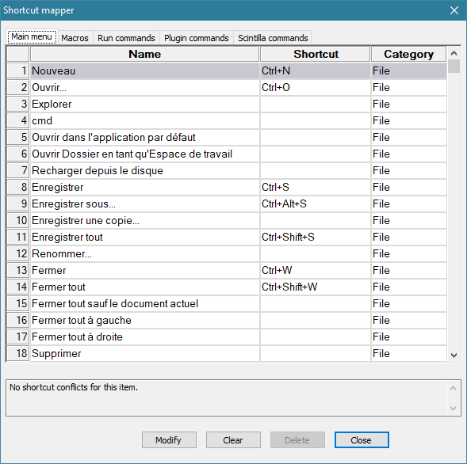
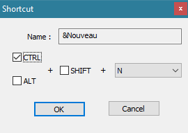

# Shortcut Mapper

Le Shortcut Mapper permet de modifier n’importe quel [raccourci clavier existant](raccourcis-clavier.md), et d’attribuer une touche aux commandes n’ayant pas de raccourci par défaut.

Il est accessible depuis le menu *Paramétrage -> Raccourcis clavier*.

Double-cliquez sur une ligne (ou *Clic droit -> Modifier*) pour ouvrir la fenêtre *Shortcut*. Décochez-y toute option pour supprimer un raccourci :

Les raccourcis de Scintilla peuvent être multiples, leur fenêtre d'attribution permet donc l'ajout ou la suppression de raccourcis pour une même fonction.
